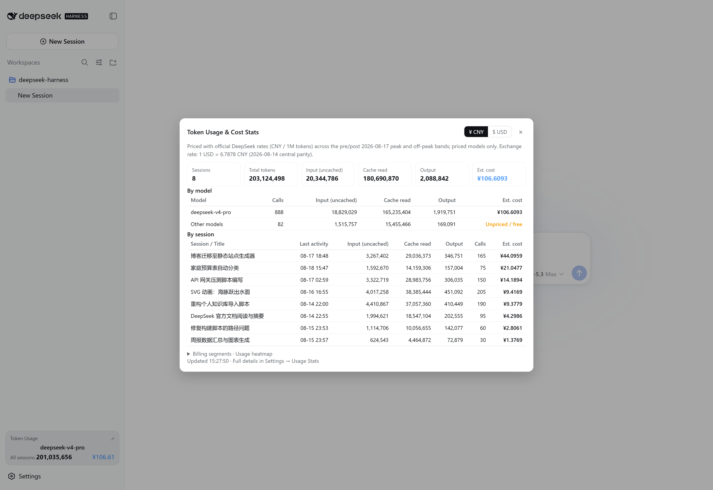
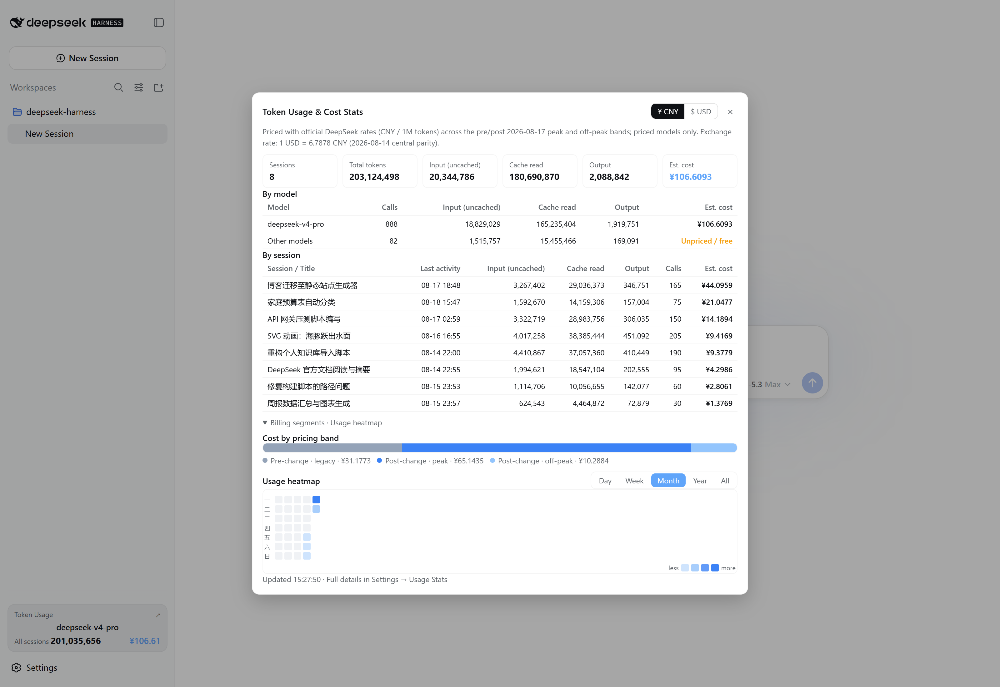
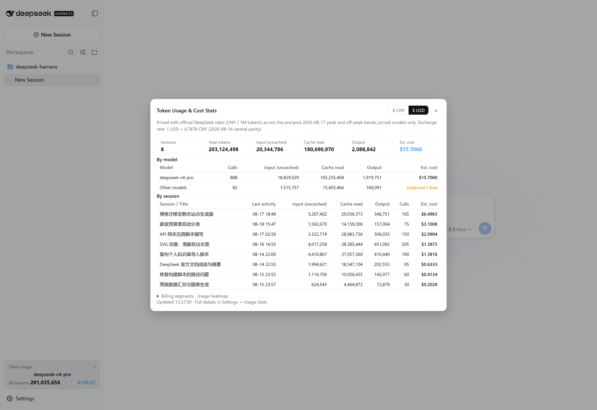
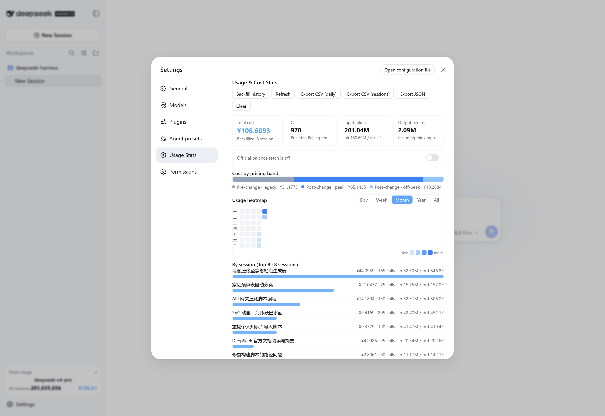

# dsh-usage-billing · Usage & Cost Statistics for DeepSeek Harness

[](https://beancookie.github.io/awesome-dsh-plugin) [](https://awesome-dsh-plugin.com)

[中文](README.md) | English

A **build-free** dual-face plugin for DeepSeek Harness: tracks every DeepSeek model call across all sessions, bills them by official pricing, and provides charted usage panels on the main UI and the settings page.

> Billing: legacy prices before 2026-08-17 00:00 (Beijing time); peak/off-peak pricing after that (peak = **weekdays** 9:00–12:00 & 14:00–18:00 (effective 2026-08-23; before that weekends also counted as peak); off-peak is half the peak rate). Price table at the bottom.

## Features

- **Automatic tracking**: listens to `llm/stream` and records every model call (input / output / cache hit / cache miss tokens)
- **Historical backfill**: on first start, scans local session logs to rebuild historical usage and cost, with session titles
- **Tiered billing**: each call falls into "pre-change · legacy", "post-change · peak", or "post-change · off-peak" by Beijing time (since 2026-08-23, peak applies on weekdays only; before that weekends also counted as peak)
- **Budget alert notifications**: desktop toast when crossing 80%/100% thresholds (once per threshold per day), plus progress bars (orange near 80%, red when over)
- **Configurable pricing**: price table, peak hours, boundary date, and USD exchange rate are all editable (changes apply to subsequent calls only), with one-click reset to defaults
- **Export**: one-click CSV (daily / per-session, filename includes the date range) or JSON export for accounting
- **Official balance**: auto-detects the configured DeepSeek API key and fetches the official account balance (total / topped up / granted), refreshing every 10 minutes; silently skipped when no key is configured
- **Daily trend chart**: 30-day daily cost bars in the settings page
- **More robust storage**: writes keep a .tmp copy and auto-recover from it when the main file is corrupt; multi-instance heartbeat detection warns about concurrent writes
- **Main UI**:
  - A "Token Usage" card at the sidebar foot (current model + this-session tokens/cost, thousands-separated) → opens a centered "Token Usage & Cost Stats" dialog (¥/USD currency toggle, overview cards, by-model / by-session tables, budget progress, official balance, billing-segment ratio, usage heatmap)
  - A persistent line under the composer showing the **current session** usage
- **Settings → Usage Stats**: full details (stat cards, budget progress, segment ratio, day/week/month/year/all heatmap with instant hover tooltips, per-session Top 8, per-model, recent calls, backfill/clear/export, pricing & budget editor)
- **Dynamic tool `usage_billing` **: the model can query statistics directly ("how much have I spent?" / "today?" — supports today/month/all scopes)
- **Persistence**: data is written to `.dsh-usage-billing.json` under the write-policy root; survives restarts (before v0.5.4: `.dsh-usage-stats.json`, auto-migrated on upgrade)
- **Bilingual UI**: all panel copy follows the app language setting (Chinese / English) and switches instantly

## Screenshots

> The screenshots below use fictional demo data.

**Stats dialog · overview** (opened from the sidebar Token Usage card)



**Stats dialog · charts** (billing-segment ratio + usage heatmap, with ¥/USD toggle)



**USD mode** (one-click toggle in the dialog header, exchange-rate converted)



**Settings · Usage Stats**



## Install

### Option A: one-line npm install (recommended, prebuilt)

```powershell
dsh plugin --profile web add dsh-usage-billing
```

npm package: https://www.npmjs.com/package/dsh-usage-billing

The package auto-mounts at startup through its `dsh.bundle.patch` (`cordis.patch.yml`) — no other configuration needed.

> ⚠ Do not patch official bundles (e.g. `@deepseek-ai/dsh-web-app/cordis.patch.yml`) directly,
> and do not place the plugin inside the `npm-cache\_npx` cache (npm reify rebuilds it and leaves dangling links).

> A local path works too: `dsh plugin --profile web add <repo path>`.

### Option B: user patch layer (without touching the profile)

Add the content of the repo-root `cordis.patch.yml` to:

```
%USERPROFILE%\.dsh\cordis.patch.yml
```

```yaml
- insert:
    - id: usage-billing
      name: 'dsh-usage-billing'
```

## Data & billing

| Data | Location / notes |
| --- | --- |
| Stats file | `.dsh-usage-billing.json` under the write-policy root (usually the user home) |
| Billing zone | Beijing time; rate-change boundary 2026-08-17 00:00 |
| Unit | CNY per million tokens |

Price table (CNY per million tokens):

| Period | Model | Cache hit | Cache miss | Output |
| --- | --- | --- | --- | --- |
| Before 8/17 | v4-flash | 0.02 | 1 | 2 |
| Before 8/17 | v4-pro | 0.025 | 3 | 6 |
| After 8/17 · off-peak | v4-flash | 0.05 | 1.5 | 4.5 |
| After 8/17 · peak | v4-flash | 0.10 | 3.0 | 9.0 |
| After 8/17 · off-peak | v4-pro | 0.15 | 4.5 | 13.5 |
| After 8/17 · peak | v4-pro | 0.30 | 9.0 | 27.0 |

> Models are classified by name substring: names containing `flash` (including vision variants like `deepseek-v4-flash-vision-exp`, officially same price) are billed at flash rates, `pro` at pro rates, others as "unpriced / free".

Reference: [DeepSeek API pricing](https://api-docs.deepseek.com/zh-cn/quick_start/pricing)

## Structure

```
.
├── lib/
│   ├── index.js     # Host half: llm/stream tracking, billing, backfill, persistence, /usage-billing route, usage_billing tool
│   └── client.js    # Client half: main-UI entries + settings panel (window.__ModuleLoader__ bundle, build-free)
├── cordis.patch.yml # Bundle patch declaring the mount row (dsh.bundle.patch mechanism)
├── package.json     # exports ("." / "./client" / "./cordis.patch.yml") + dsh.client / dsh.bundle declarations
├── PUBLISH.md       # Publishing guide (GitHub / npm / install)
├── LICENSE
└── README.md
```

## FAQ

- **Doubled stats**: older versions rebuilt without clearing first; since v0.2.0 a `schemaVersion` migration marker triggers a single clean rebuild on restart.
- **Panel not showing**: the client bundle is discovered by the deployment's `clientModules` service; restart the app and refresh the page after first install.
- **Two instances at once**: the stats file is a shared resource and concurrent writes overwrite each other — keep a single instance.
- **Overwritten by upgrades**: redeploying the app directory overwrites built-in patch lines and package files; re-run the install step.

## License

MIT
